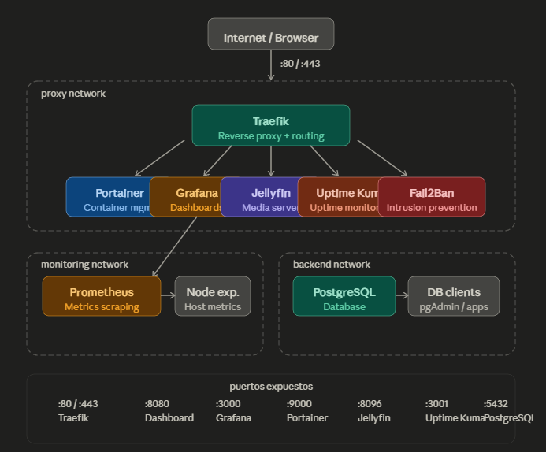

# Architecture

## Overview

This homelab runs entirely on Docker Compose with isolated networks
for security and separation of concerns.

## Networks

| Network | Purpose |
|---|---|
| `proxy` | Public-facing services behind Traefik |
| `monitoring` | Internal metrics (Prometheus + Grafana) |
| `backend` | Databases and internal services |

## Services

### Reverse Proxy — Traefik
Handles all incoming traffic and routes by hostname.
Dashboard available at `http://localhost:8080`.

### Monitoring — Prometheus + Grafana
Prometheus scrapes metrics every 15s.
Grafana visualizes them at `http://localhost:3000`.

### Media Server — Jellyfin
Self-hosted media streaming at `http://localhost:8096`.

### Database — PostgreSQL 16
Used as backend database for services that require persistence.

### Container Management — Portainer
Visual Docker management at `http://localhost:9000`.

### Uptime Monitoring — Uptime Kuma
Tracks uptime of all services at `http://localhost:3001`.

## Diagram

### Networks

| Network | Services |
|---|---|
| `proxy` | Traefik, Portainer, Grafana, Jellyfin, Uptime Kuma |
| `monitoring` | Prometheus, Grafana, Node Exporter |
| `backend` | PostgreSQL |